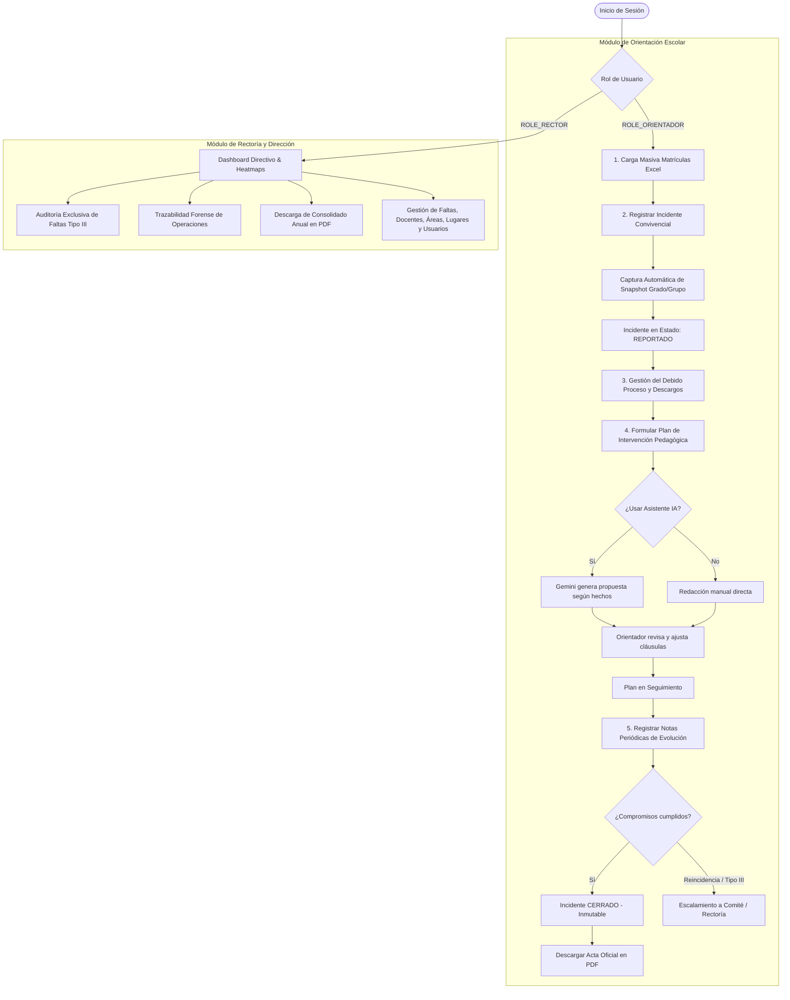

# CONTEXTO INTEGRAL DEL SISTEMA • DISCIPLINA WEB
> **Documentación Oficial de Arquitectura, Flujos de Trabajo, Reglas de Negocio y Operación**  
> *Fecha de actualización:* Septiembre 2026  
> *Versión del sistema:* 3.0-SNAPSHOT  
> *Institución de Referencia:* Institución Educativa Manuel J. Betancur / IE Trujillo  
> *Propósito de este archivo:* Servir como fuente de verdad técnica y de negocio para desarrollo, auditoría y despliegue en múltiples entornos.

---

## 1. Ficha Técnica y Propósito del Sistema

### 1.1 Misión del Software
**Disciplina Web** es una plataforma web enterprise orientada a la **gestión integral de la convivencia escolar, garantía del debido proceso disciplinario/formativo y seguimiento pedagógico** en instituciones educativas de Colombia.

El sistema fue diseñado para dar cumplimiento estricto a:
1. **Ley 1620 de 2013**: *Sistema Nacional de Convivencia Escolar y Formación para el Ejercicio de los Derechos Humanos, la Educación para la Sexualidad y la Prevención y Mitigación de la Violencia Escolar*.
2. **Decreto 1965 de 2013**: *Reglamentación de la Ley 1620 (clasificación de faltas Tipo I, Tipo II y Tipo III, protocolos de atención, debido proceso y rutas integrales de convivencia)*.
3. **Sentencias de la Corte Constitucional Colombiana** (T-478/15, T-917/14, entre otras): *Garantía de presunción de inocencia, derecho a ser escuchado (descargos), proporcionalidad restaurativa y no discriminación*.

### 1.2 Filosofía Pedagógica
El software **no es una plataforma punitiva ni un simple registro de sanciones**. Es un sistema de **justicia restaurativa y acompañamiento pedagógico formativo**, donde cada reporte permite registrar hechos objetivos, tomar descargos en tiempo y forma, formular planes de intervención con corresponsabilidad familiar y mantener la trazabilidad inmutable de cada caso.

---

## 2. Stack Tecnológico

### 2.1 Backend
- **Lenguaje:** Java 21 LTS.
- **Framework Principal:** Spring Boot 3.3.4.
- **Seguridad:** Spring Security 6 con autenticación JWT Stateless:
  - Clave de firma HMAC-SHA256 de 648 bits.
  - Expiración de token: 8 horas (28.800.000 ms).
  - Encriptación de contraseñas: BCryptPasswordEncoder con factor de trabajo 12 (`$2a$12$...`).
  - Roles institucionales: `ROLE_RECTOR` (Directivo) y `ROLE_ORIENTADOR` (Orientador/Docente de apoyo).
- **Persistencia & Datos:**
  - PostgreSQL 16.
  - Spring Data JPA / Hibernate 6.5.3.
  - Flyway 10.x para control de versiones y migraciones de esquemas (`V1__...` a `V12__...`).
  - Pool de conexiones HikariCP configurado con validación de conexiones activas.
- **Generación Documental:** OpenPDF 2.0.3 para emisión de actas oficiales de descargos y consolidado anual en formato PDF mediante `StreamingResponseBody` (generación en memoria sin uso de archivos temporales en disco).
- **Procesamiento de Archivos:** Apache POI 5.2.5 para lectura, validación y carga masiva de archivos Microsoft Excel (`.xlsx` y `.xls`) de matrículas y nómina docente con tolerancia a variantes en cabeceras.
- **Inteligencia Artificial:** Integración REST con Google Gemini API (modelo generativo para sugerencia de diagnósticos situacionales, acuerdos formativos y recomendaciones) con mecanismo de fallback determinista local ante indisponibilidad de red.
- **Auditoría:** `AuditoriaService` con persistencia de diffs y eventos en la tabla `auditoria_sistema`.
- **Testing:** JUnit 5, Mockito, AssertJ, Spring MockMvc (81 pruebas automatizadas pasando al 100%).

### 2.2 Frontend
- **Framework & Runtime:** React 18.3 + TypeScript 5.4.
- **Empaquetador & Dev Server:** Vite 5.4.
- **Estilos:** Tailwind CSS v3 con paleta institucional personalizada (IE Trujillo: azul marino institucional `#1E3A8A`, gris pizarra `slate`, acentos ámbar de advertencia y esmeralda de conformidad).
- **Iconografía:** Lucide React (iconografía sobria, líneas de 1.75).
- **Visualización de Datos:** Recharts (mapas de calor por día y hora, distribución de faltas por tipo y gráficos de barras de reincidencia escolar).
- **Estado Global:** Zustand con persistencia en `localStorage` (`useAuthStore`).
- **Cliente HTTP:** Axios 1.7 configurado en `apiClient.ts` con interceptor para adjuntar token Bearer JWT y extractor universal de mensajes de error (`extraerMensajeError`).
- **Ergonomía de Interfaz:**
  - Bloqueo de scroll dual mediante hook personalizado `useLockBodyScroll` (bloquea tanto `document.body` como contenedores con `overflow-y-auto`).
  - Desactivación forzada de autocompletado nativo flotante en campos de búsqueda (`autoComplete="off" spellCheck={false} name="*-no-autofill"`).
  - Cero modals invasivos con fondos oscuros gigantes; adopción del patrón Enterprise Header con borde tenue inferior, contenedor suave de icono y botón de cierre discreto.

---

## 3. Arquitectura del Software

```
disciplina-web/
├── backend/
│   ├── src/main/java/com/disciplina/
│   │   ├── config/             # Configuración de Seguridad, CORS, Flyway, Beans
│   │   ├── controller/         # Controladores REST (/api/v1/...)
│   │   ├── domain/
│   │   │   ├── enums/          # Enumeraciones de negocio (Faltas, Estados, Roles)
│   │   │   ├── model/          # Entidades JPA (Estudiante, Incidente, Plan, etc.)
│   │   │   └── repository/     # Repositorios Spring Data JPA
│   │   ├── dto/                # Data Transfer Objects agrupados por módulo
│   │   ├── security/           # Filtro JWT, UserDetailsService, JwtTokenProvider
│   │   └── service/            # Lógica transaccional de negocio, auditoría e importadores
│   └── src/main/resources/
│       ├── db/migration/       # Scripts SQL Flyway ordenados (V1 a V12)
│       └── application.yml     # Configuración de base de datos, JWT y perfiles
├── frontend/
│   ├── src/
│   │   ├── core/               # ApiClient, AuthStore, Hooks transversales (useLockBodyScroll)
│   │   ├── features/
│   │   │   ├── auth/           # Login y protección de sesión
│   │   │   ├── incidentes/     # Registro y Detalle del Debido Proceso (Modales)
│   │   │   ├── matriculas/     # Carga masiva Excel y Expediente del Estudiante
│   │   │   ├── orientador/     # Vistas y layouts de Orientación Escolar
│   │   │   ├── planes/         # Formulación y seguimiento de acuerdos pedagógicos
│   │   │   └── rectoria/       # Dashboard, Auditoría Forense, Faltas Tipo III, Configuración
│   │   └── routes/             # Enrutamiento React Router con React.lazy()
│   └── tailwind.config.js      # Tokens de diseño enterprise y colores institucionales
├── docs/                       # Documentación técnica, diagramas y contexto
└── SAD-DisciplinaWeb-v3.md     # Documento de Arquitectura de Software base
```

---

## 4. Modelo de Datos y Entidades Principales

### 4.1 Diagrama Entidad-Relación Conceptual
- **`usuarios`**: Cuentas del personal (`ROLE_RECTOR`, `ROLE_ORIENTADOR`).
- **`estudiantes`**: Alumnos registrados con documento único e identidad.
- **`matriculas`**: Historial de matrículas por año lectivo, grado, grupo y jornada.
- **`areas_desempeno`**: Catálogo formal de áreas académicas/curriculares (Matemáticas, Humanidades, etc.).
- **`docentes`**: Personal docente institucional vinculado a un área de desempeño mediante `area_desempeno_id`.
- **`lugares`**: Espacios físicos de la institución (Patio, Aula, Baños, Cafetería, etc.).
- **`catalogo_faltas`**: Faltas tipificadas según Ley 1620 (`TIPO_I`, `TIPO_II`, `TIPO_III`) y gravedad institucional (`LEVE`, `GRAVE`, `GRAVISIMA`).
- **`incidentes`**: Caso convivencial registrado con fecha, hora, lugar, docente reportante, narrativa y estado de debido proceso.
- **`incidente_estudiantes`**: Tabla asociativa con el rol de cada alumno en el incidente (`AGRESOR`, `VICTIMA`, `PARTICIPE`, `TESTIGO`), falta disciplinaria tipificada, descargos y **snapshot inmutable de grado y grupo al momento del hecho**.
- **`planes_intervencion`**: Acuerdos pedagógicos y compromisos formativos vinculados a un estudiante y a su incidente de origen.
- **`seguimientos_caso`**: Bitácora cronológica de notas de evolución pedagógica de cada plan.
- **`auditoria_sistema`**: Registro inmutable de trazabilidad forense con operador, acción, entidad y diff en formato JSONB.

### 4.2 Historial de Migraciones Flyway
1. **`V1__init_schema.sql`**: Esquema relacional fundacional (tablas de usuarios, estudiantes, docentes, lugares, faltas, incidentes e involucrados).
2. **`V2__seed_catalogo_faltas.sql`**: Poblamiento inicial del manual de convivencia y tipificación bajo Ley 1620.
3. **`V3__indices_rendimiento.sql`**: Índices de optimización para búsquedas por documento, nombres y fechas.
4. **`V4__auditoria_sistema.sql`**: Creación de la tabla `auditoria_sistema` para rastreo forense.
5. **`V5__matriculas_historicas.sql`**: Tabla `matriculas` para trazabilidad por año lectivo, grado y grupo sin promoción ciega.
6. **`V6__snapshot_grado_grupo_incidente.sql`**: Inclusión obligatoria de `grado_momento` y `grupo_momento` en `incidente_estudiantes`.
7. **`V7__planes_intervencion.sql`**: Tablas `planes_intervencion` y `seguimientos_caso` para el módulo restaurativo.
8. **`V8__datos_acudiente_matricula.sql`**: Extensión de datos de contacto de padres/acudientes en la matrícula.
9. **`V9__ajuste_secuencias_claves.sql`**: Normalización de secuencias autonuméricas y restricciones de integridad.
10. **`V10__incidente_origen_en_plan.sql`**: Vinculación foránea estricta de `incidente_origen_id` en planes de intervención.
11. **`V11__auditoria_indices.sql`**: Índices compuestos para consultas rápidas de auditoría por fecha y operador.
12. **`V12__area_desempeno.sql`**: Creación de la tabla `areas_desempeno`, población de 9 áreas curriculares oficiales del MEN + `PENDIENTE POR REGISTRO`, adición de la columna `area_desempeno_id` en `docentes` y migración de datos preexistentes.

---

## 5. Reglas de Negocio Críticas (Invariantes del Dominio)

Estas reglas están blindadas tanto a nivel de controladores y servicios en el backend como en la experiencia de usuario en el frontend:

### Regla 1: Snapshot Inmutable de Matrícula al Momento del Hecho
- Cuando se registra un incidente convivencial, el sistema busca la matrícula activa del estudiante para el año en curso y captura automáticamente en `incidente_estudiantes`:
  - `gradoMomento`: Ej. `9`
  - `grupoMomento`: Ej. `2`
- **Justificación Jurídica:** Si el estudiante es promovido de grado o cambia de grupo en los años siguientes, el acta del incidente permanece históricamente exacta con el salón donde ocurrió la falta, preservando la validez legal del expediente.

### Regla 2: Tipificación Obligatoria para Implicados
- Todo alumno que figure en un incidente con rol `AGRESOR` o `PARTICIPE` **debe tener al menos una falta disciplinaria tipificada del catálogo oficial**.
- Los alumnos con rol `VICTIMA` o `TESTIGO` no requieren tipificación de falta.

### Regla 3: Inmutabilidad Estricta de Casos Cerrados (`CERRADO`)
- Un incidente que ha culminado su debido proceso y pasa al estado `CERRADO` **no puede ser reabierto ni modificado bajo ninguna circunstancia**:
  - El backend arroja una excepción `OperacionInvalidaException` (HTTP 400): *"No es posible modificar el estado de un incidente que ya se encuentra CERRADO (debido proceso concluido)"*.
  - En la interfaz, todos los campos, selectores y botones de guardado se inhabilitan automáticamente, mostrando un sello visual de *Caso Concluido*.

### Regla 4: Condición de Incidente Previo para Formular Planes de Intervención
- **No es admisible formular un plan de intervención formativa a un estudiante que no registra incidentes disciplinarios previos**:
  - La formulación pedagógica exige asociar obligatoriamente un `incidenteOrigenId` verídico.
  - La interfaz muestra un banner ámbar explicativo: *"Estudiante sin incidentes disciplinarios registrados. De acuerdo con el Manual de Convivencia y la Ley 1620, los planes de intervención requieren un incidente previo reportado en el sistema"*.
  - El botón de invocar al Asistente IA permanece deshabilitado hasta que se selecciona un incidente real de la lista desplegable.

### Regla 5: Principio Human-in-the-Loop en Inteligencia Artificial
- La IA (Google Gemini) actúa **exclusivamente como asistente de redacción y estructurador documental**.
- **La IA nunca guarda ni persiste datos de manera autónoma**:
  - Al presionar *"Sugerir con Asistente IA"*, el modelo genera una propuesta en campos de texto editables (`diagnostico`, `accionesAcordadas`, `compromisoPadres`, `recomendacionesIa`).
  - El orientador escolar tiene la obligación profesional de revisar, validar, editar y ajustar las cláusulas antes de proceder con el guardado formal.

### Regla 6: Autoprotección de Cuentas de Usuario en Configuración
- En el módulo de administración (`/configuracion`), el usuario autenticado que realiza la gestión **no puede desactivar su propia cuenta activa**:
  - El backend valida contra el `SecurityContextHolder` y lanza `IllegalStateException`: *"No puede desactivar su propia cuenta activa"*.
  - Al crear usuarios nuevos, la contraseña es obligatoria y se encripta con BCrypt (factor 12); al editar, si el campo se deja en blanco, se conserva el hash previo intacto.

### Regla 7: Idempotencia en Importaciones Masivas (Excel)
- La carga masiva de matrículas y docentes utiliza el documento de identidad (`documento` / `cedula`) como clave natural única de reconciliación:
  - Si el alumno o docente ya existe, se actualizan sus nombres, apellidos o grado sin duplicar registros.
  - Si no existe, se inserta como nuevo registro.
  - El motor soporta variaciones habituales en las cabeceras de Excel (ej. `DOCUMENTO`, `CEDULA`, `IDENTIFICACION`; `1NOMBRE`, `NOMBRES`; `AREA`, `AREA DE DESEMPEÑO`).

---

## 6. Flujos de Trabajo Principales (Workflows End-to-End)



### 6.1 Detalle del Flujo de Convivencia y Debido Proceso (Orientador)
1. **Inicio del Caso:** Ocurre un hecho de convivencia. El orientador abre el modal *"Registrar Incidente"* en `/orientador/incidentes`.
2. **Asociación de Hechos:** Selecciona fecha, hora estimada, lugar institucional físico y docente que reporta.
3. **Identificación de Involucrados:** Busca a los estudiantes involucrados en el censo oficial. Asigna a cada uno su rol (`AGRESOR`, `VICTIMA`, `PARTICIPE`, `TESTIGO`). Si es agresor o partícipe, selecciona la falta cometida del catálogo de convivencia escolar. El sistema graba inmutablemente el grado y grupo en que se encontraba el menor en ese momento.
4. **Debido Proceso y Descargos:** En el modal *"Detalle de Incidente"*, el orientador cita a los acudientes, escucha la versión libre del estudiante y digita sus descargos formales. Puede cambiar el estado procesal por etapas (`REPORTADO` ➔ `EN_INDAGACION` ➔ `CITACION_ACUDIENTE` ➔ `EN_INTERVENCION` ➔ `CERRADO`).
5. **Formulación de Acuerdo Pedagógico:** En la pestaña *"Planes & Apoyo"* del expediente del alumno o en `/orientador/planes`:
   - Selecciona el caso convivencial de origen.
   - Presiona *"Sugerir con Asistente IA"*: el backend consulta a Google Gemini enviando los antecedentes reales y la tipificación legal. Gemini devuelve el diagnóstico, medidas restaurativas y compromisos familiares.
   - El orientador ajusta el borrador en los campos de redacción tipo acta formal (`rows={4}`, `min-h-[110px]`, `leading-relaxed`).
   - Guarda el plan, fijando la fecha del próximo control y el estado `EN_SEGUIMIENTO`.
6. **Seguimiento y Cierre:** El orientador va registrando bitácoras de avance (`SeguimientoCaso`). Cuando se cumplen todos los acuerdos, el incidente se marca como `CERRADO`. A partir de ese segundo, el acta queda sellada e inmutable y se puede descargar el PDF formal para la carpeta física del alumno.

### 6.2 Detalle del Flujo Directivo y Auditoría (Rector)
1. **Dashboard:** En `/rectoria/dashboard`, el rector consulta métricas ejecutivas en tiempo real: total de incidentes del año, casos cerrados vs. abiertos, tasa de reincidencia, mapa de calor horario (horas pico de conflicto) y lugares con mayor criticidad.
2. **Faltas Tipo III:** En `/rectoria/faltas-graves`, supervisa con alerta roja inmediata los casos de extrema gravedad (porte de armas, acoso sexual, agresiones físicas graves), con acceso directo a la descarga del acta y remisión a entidades externas (ICBF, Policía de Infancia y Adolescencia).
3. **Auditoría Forense:** En `/rectoria/auditoria`, visualiza cada transacción ejecutada en el sistema, visualizando el diff JSONB entre el estado anterior y el estado posterior, fecha exacta y nombre del funcionario responsable.
4. **Reportes:** En `/rectoria/reportes`, genera el informe consolidado anual en formato PDF listo para radicar ante la Secretaría de Educación Departamental/Municipal.
5. **Configuración Institucional:** En `/rectoria/configuracion`, administra en 5 pestañas los catálogos del colegio:
   - *Catálogo de Faltas*: creación y activación de faltas institucionales con tipificación Ley 1620.
   - *Docentes*: listado de profesores, vinculación a áreas académicas y botón de *Carga Masiva Excel* con plantilla descargable.
   - *Áreas de Desempeño*: gestión de departamentos curriculares de la institución (CRUD completo).
   - *Lugares*: catálogo de espacios físicos institucionales.
   - *Usuarios*: administración de cuentas del personal con resguardo de contraseñas BCrypt y control de auto-desactivación.

---

## 7. Catálogo de Endpoints de la API REST

### Autenticación (`/api/v1/auth`)
- `POST /auth/login`: Autentica credenciales y emite token JWT con roles.

### Matrículas y Estudiantes (`/api/v1/matriculas`)
- `POST /matriculas/importar-masivo`: Carga de archivo Excel `.xlsx`/`.xls` de estudiantes.
- `GET /matriculas/plantilla-ejemplo`: Descarga de la plantilla oficial Excel de matrículas.
- `GET /matriculas/estudiantes/buscar?q=`: Búsqueda de alumnos para dropdowns institucionales.
- `GET /matriculas/estudiantes/{id}/expediente-integral`: Ficha acumulativa de convivencia, matrículas y planes de un alumno.

### Catálogos de Referencia (`/api/v1/catalogo`)
- `GET /catalogo/faltas`: Listado de faltas activas para tipificación en incidentes.
- `GET /catalogo/docentes`: Listado de docentes activos con su área de desempeño vinculada.
- `GET /catalogo/lugares`: Espacios físicos institucionales activos.

### Áreas de Desempeño (`/api/v1/areas-desempeno`)
- `GET /areas-desempeno/activas`: Listado activo para selectores de formularios.
- `GET /areas-desempeno?page=0&size=15&q=`: Listado paginado con búsqueda para Rectoría.
- `POST /areas-desempeno`: Crear nueva área académica (`ROLE_RECTOR`).
- `PUT /areas-desempeno/{id}`: Actualizar área académica (`ROLE_RECTOR`).
- `DELETE /areas-desempeno/{id}`: Desactivación lógica de un área (`ROLE_RECTOR`).
- `PATCH /areas-desempeno/{id}/toggle-activo`: Alternar estado activo/inactivo (`ROLE_RECTOR`).

### Incidentes y Convivencia (`/api/v1/incidentes`)
- `GET /incidentes?page=0&size=15`: Listado de incidentes registrados.
- `POST /incidentes`: Registro de un nuevo incidente colectivo con snapshot de matrícula.
- `GET /incidentes/{id}`: Detalle completo de un caso con lista de involucrados y descargos.
- `PATCH /incidentes/{id}/estado`: Transición de estado procesal (`REPORTADO` a `CERRADO`).
- `PUT /incidentes/{id}/involucrados/{involucradoId}/descargos`: Registro y actualización de descargos del estudiante.

### Planes de Intervención & Seguimiento (`/api/v1/planes-intervencion`)
- `GET /planes-intervencion?page=0&size=15`: Listado general de planes formulados.
- `GET /planes-intervencion/estudiante/{estudianteId}`: Planes pertenecientes a un alumno.
- `POST /planes-intervencion`: Creación y formalización de un nuevo plan pedagógico.
- `POST /planes-intervencion/ia/generar-propuesta/{estudianteId}?incidenteId=`: Generación de borrador pedagógico asistido por Gemini IA.
- `POST /planes-intervencion/{id}/seguimientos`: Registro de bitácora y evolución pedagógica.

### Rectoría, Auditoría & Reportes (`/api/v1/rectoria`, `/api/v1/auditoria`, `/api/v1/reportes`)
- `GET /rectoria/dashboard/metricas`: Métricas agregadas, heatmap y estadísticas de convivencia.
- `GET /rectoria/faltas-tipo-3`: Listado prioritario de incidentes de extrema gravedad.
- `GET /auditoria?page=0&size=20`: Registro de trazabilidad forense con operador y diff JSONB.
- `GET /reportes/pdf/incidente/{id}`: Descarga del acta oficial individual de descargos en PDF.
- `GET /reportes/pdf/consolidado-anual`: Descarga del informe anual consolidado en PDF.

### Configuración del Sistema (`/api/v1/configuracion`)
- CRUD completo y toggles de estado para:
  - `catalogo-faltas`
  - `docentes` (incluyendo `POST /docentes/importar-masivo` y `GET /docentes/plantilla-ejemplo`)
  - `lugares`
  - `usuarios` (con control de auto-desactivación y hash BCrypt)
  - `incidentes` (eliminación administrativa autorizada exclusivamente a Rectoría)

---

## 8. Sistema de Diseño Enterprise (UI/UX Guidelines)

1. **Jerarquía Visual y Paleta:**
   - Color Institucional Primario: Azul Marino Trujillo (`#1E3A8A` / `bg-trujillo-navy`).
   - Superficies: Fondo de página `bg-slate-50`, tarjetas y modales `bg-white border border-slate-200 shadow-sm`.
   - Banners de Alerta Informativa (Ámbar oficial):
     `bg-amber-50/80 border border-amber-200/90 rounded-lg p-3.5 flex gap-3 text-amber-900`
   - Banners de Propuesta Asistida por IA (Azul institucional sobrio):
     `bg-sky-50/70 border border-sky-200/80 rounded-lg p-3 flex items-start gap-2.5 text-sky-900`
   - Banners de Peligro / Infracciones Críticas (Rojo suave):
     `bg-rose-50 border border-rose-200 text-rose-800`

2. **Estilo de Diálogos / Modales Enterprise:**
   - Queda totalmente prohibido colocar banners azul marino gigantes u oscuros de IA en los encabezados.
   - Las cabeceras deben usar:
     ```tsx
     <div className="flex items-center justify-between px-6 py-4 border-b border-slate-200 bg-slate-50/50">
       <div className="flex items-center gap-2.5">
         <div className="p-2 bg-blue-50 text-blue-900 rounded-md border border-blue-100">
           <IconComponent className="w-5 h-5 stroke-[1.75]" />
         </div>
         <div>
           <h3 className="text-base font-bold text-slate-900 tracking-tight leading-none">{titulo}</h3>
           <p className="text-xs text-slate-500 mt-1 leading-none">{subtitulo}</p>
         </div>
       </div>
       <button onClick={onClose} className="p-1.5 text-slate-400 hover:text-slate-700 rounded-md hover:bg-slate-100">
         <X className="w-4 h-4" />
       </button>
     </div>
     ```
   - El pie del modal debe ser sobrio y fijo:
     `bg-slate-50/80 px-6 py-3 border-t border-slate-200 flex justify-end gap-2`

3. **Textareas y Redacción Documental:**
   - Altura mínima `min-h-[110px]` o `rows={4}`, relleno `p-3`, tipografía `text-xs text-slate-800 leading-relaxed font-normal` y redimensionamiento vertical `resize-y`.
   - Evita barras de scroll verticales internas diminutas.

4. **Campos de Búsqueda y Autocompletado:**
   - Todos los inputs de búsqueda de estudiantes o catálogos deben incorporar:
     `autoComplete="off" spellCheck={false} name="student-search-query-no-autofill"`

---

## 9. Convenciones de Desarrollo y Git

1. **Mensajes de Commit (Conventional Commits):**
   - **Prefijo estrictamente en inglés:** `feat`, `fix`, `refactor`, `style`, `docs`, `test`, `chore`.
   - **Texto descriptivo y scope en español:**
     - Ejemplo: `feat(planes): exigir incidente de origen obligatorio para formular planes e intervenciones con IA`
     - Ejemplo: `refactor(ui/modales): estandarizar diseno de modales e implementar catalogo de areas de desempeno`
     - Ejemplo: `style(planes): redisenar formulario documental de planes y propuesta asistida por IA`
2. **Cero Atribución:** Prohibido agregar líneas de `Co-Authored-By` o menciones de autoría asistida por IA en los commits.
3. **Calidad y Pruebas Previas a Commit:**
   - En backend: `.\mvnw.cmd test -q` (deben pasar los 81 tests con 0 fallos).
   - En frontend: `npm run build` (debe compilar `tsc && vite build` con 0 advertencias o errores).

---

## 10. Guía Rápida para Levantar el Proyecto en Otra Máquina

### Requisitos Previos
1. **Java JDK 21** configurado en `JAVA_HOME`.
2. **Node.js 20+** y `npm`.
3. **PostgreSQL 16** escuchando en el puerto local `5432` con una base de datos creada llamada `disciplina_db` (o usando Docker).

### Paso 1: Configurar Variables de Entorno
Copia `.env.example` a `.env` en la raíz del repositorio y configura las credenciales de PostgreSQL y la clave de API de Gemini (`GEMINI_API_KEY`).

### Paso 2: Base de Datos con Docker (Opcional si no tienes Postgres local)
```bash
docker compose up -d postgres
```

### Paso 3: Compilar y Ejecutar el Backend
```bash
cd backend
.\mvnw.cmd clean test-compile
.\mvnw.cmd test -q
.\mvnw.cmd spring-boot:run
```
*El backend iniciará en `http://localhost:8080`, aplicando automáticamente las 12 migraciones de Flyway.*

### Paso 4: Compilar y Ejecutar el Frontend
```bash
cd ../frontend
npm install
npm run build
npm run dev
```
*El frontend iniciará en `http://localhost:5173` y conectará automáticamente mediante el proxy de Vite o Axios a `http://localhost:8080/api/v1`.*

### Credenciales por Defecto de Prueba (Seeded):
- **Rectoría:**
  - Usuario: `rector`
  - Contraseña: `password123`
- **Orientación:**
  - Usuario: `orientador`
  - Contraseña: `password123`
